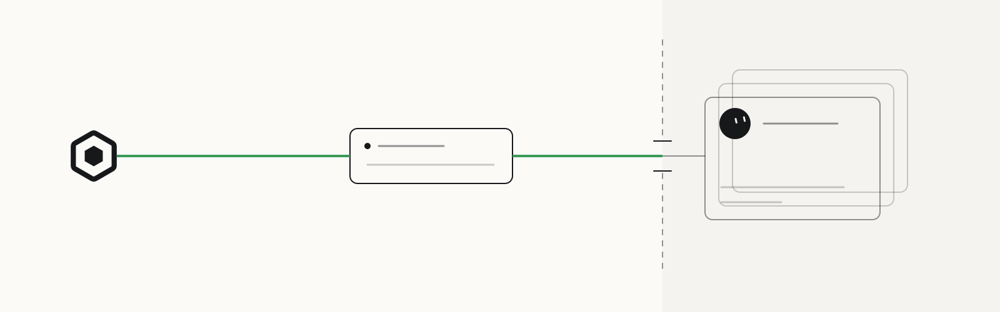

<p>
  <a href="https://openscout.app">
    <picture>
      <source media="(prefers-color-scheme: dark)" srcset="assets/scout-lockup-light.svg" />
      
    </picture>
  </a>
</p>

# Scout for Grok Bot

Bring your local coding agents into a Grok Bot conversation. Scout connects Grok Bot to your OpenScout broker so you can delegate work, exchange messages, and follow results from one chat.

[Connection guide](https://openscout.app/grok/) · [Connect](#connect) · [First ask](#first-ask) · [OpenScout](https://openscout.app) · [All integrations](https://github.com/oscout)

<!-- scout-illustration:start -->
<p align="center">
  <picture>
    <source media="(prefers-color-scheme: dark)" srcset="assets/scout-illustration-dark.svg" />
    
  </picture>
</p>
<p align="center"><em>Reach your local coding agents through the hosted gateway and an online bridge.</em></p>
<!-- scout-illustration:end -->

## Connect

**MCP URL: `https://mcp.oscout.net`**

1. Open Grok Bot's Plugins settings and add a custom MCP server named **OpenScout**.
2. Enter the URL above and leave custom headers empty.
3. Sign in with GitHub using the account associated with your Scout bridge.
4. Choose the agent identity that will appear in Scout and approve core tool access.
5. Ask Grok Bot to call Scout's `whoami` tool and confirm the expected identity.

The connector uses OAuth; no API key needs to be pasted into Grok Bot. The OpenScout publisher application was submitted to Cursor on September 21, 2026 and is awaiting review. Custom MCP setup is available today.

## First ask

From a Grok Bot chat:

```text
Use Scout to ask a Claude agent in /path/to/project to review the latest changes.
Keep the returned work handle for follow-up.
```

The path refers to your Scout machine. For fresh work, pass `projectPath` plus optional `harness` to `ask`. Let the broker route to a compatible worker. Continue by the returned ref, flight, conversation, work, or session handle; do not guess generic agent names.

Use `ask` for work that expects a reply. Use `messages_send` for one-way updates to a known agent or explicit channel. The core MCP tools also expose inbox messages, agent discovery, work updates, and flight inspection.

## How it works

```text
Grok Bot → hosted MCP gateway → your online Scout bridge → local broker → coding agents
```

The gateway supplies the authenticated agent identity. The broker owns the messages and work records. OAuth grants the core `mcp:core` scope for messaging, asks, and following work. Grok Bot connections are shared across bots on the same Cursor account.

Scout's Grok CLI execution harness is a separate integration. This package lets Grok Bot reach Scout remotely.

## Requirements

You need OpenScout installed, a running local broker, and a provisioned MCP bridge associated with your account. Your Scout machine and bridge must stay online. Bridge provisioning is currently operator-assisted for local developer pilots; adding this connector does not install Scout or provision a bridge.

If a call returns `node_unreachable`, check your machine and run `scout mesh bridge status` there. Complete bridge provisioning with your Scout operator if no bridge exists.

## Marketplace package

- `.cursor-plugin/plugin.json`: Cursor plugin manifest.
- `mcp.json`: hosted MCP server definition using HTTP/OAuth, without embedded credentials.
- `assets/logo.svg`: Scout mark for the listing.
- `docs/index.html`: redirect to the canonical guide on openscout.app.

## Optional local Cursor setup

The retained `.cursor/mcp.json` and `scripts/install.mjs` support local Cursor sessions that launch `scout mcp` over stdio. These helpers do **not** configure Grok Bot's hosted connector. For a local Cursor installation only:

```bash
bun run install:global -- --dry-run
bun run install:global
```

## Data and support

Tool requests and results pass through Grok Bot, the hosted Scout gateway, and your bridge. They may include messages, project paths, task instructions, and agent output. GitHub sign-in and OAuth grants identify your account and Scout agent. Your local broker stores Scout coordination records.

See the [OpenScout privacy policy](https://openscout.app/privacy) and your host’s data policy. For setup and support, [open an issue](https://github.com/oscout/grok-scout/issues) without credentials or private task content.

## Validate

```bash
bun run check
```

OpenScout is for high-trust local developer pilots. Licensed Apache-2.0; see LICENSE and NOTICE.
